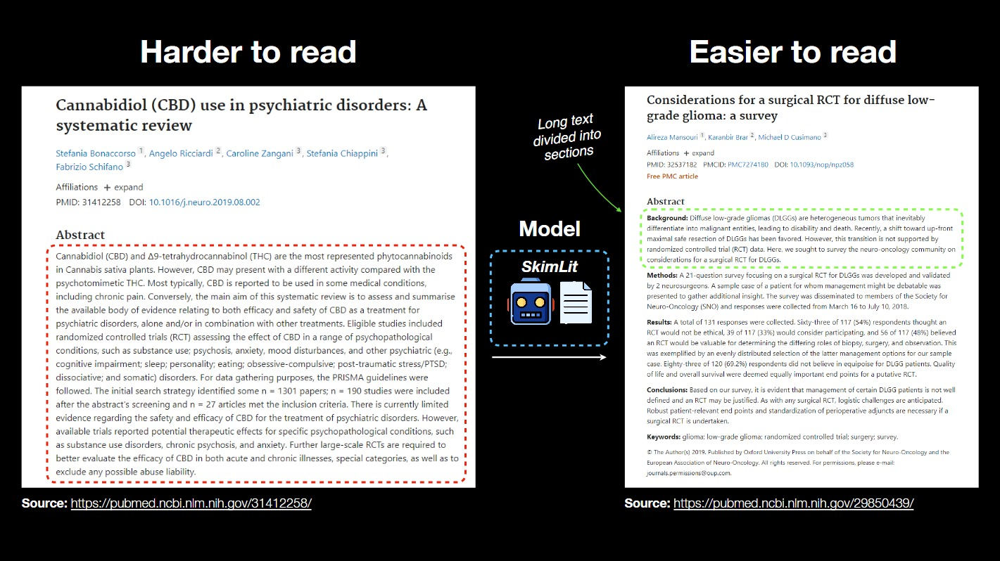

# SkimLit📄⚡
Code for building a machine learning-powered app to classify abstract sentences into their relevant heading (e.g. objective, methods, results, etc..), so you can quickly skim through abstracts and find the information you need. This project is inspired by the 2017 paper PubMed [200k RCT: a Dataset for Sequential Sentence Classification in Medical Abstracts](https://arxiv.org/abs/1710.06071).





See it working live at: **[WEB APP](https://huggingface.co/spaces/sirfindcent/skimlit)**

## Models Experiments
To build the app, I've tried several models. The following table shows some of the best-performing models. All the notebooks are available [here]("https://github.com/sirfindcent/skimlit/Notebooks")


| Model name | Components | Accuracy |
|---|---|---|
| Bert Token model | BERT model pre-trained on MEDLINE/PubMed | 85% |
| Tribrid model | Universal Sentence Encoder, character embeddings, positional embeddings | 86% |
| Bert Tribrid model | PUBMED BERT, character embeddings, positional embeddings | 88% |

The models are trained on [PubMed 200k RCT dataset](https://github.com/Franck-Dernoncourt/pubmed-rct). 

## Steps to run the app locally
If this doesn't work please [leave an issue](https://github.com/sirfindcent/skimlit/issues).

### Clone the repo
```
git clone https://github.com/sirfindcent/skimlit
cd skimlit
```

### Create the environment
I use `venv` for my environment and PowerShell for the command. You could do similar with Conda and pip but I prefer venv.

```
python -m venv myvenv
myvenv/Scripts/activate.ps1
pip install -r requirements.txt
```

### Install the GloVe embeddings
This command will download the glove embeddings file from the website using `wget`, and unzip it to the `utils` folder.

```
wget http://nlp.stanford.edu/data/glove.6B.zip
unzip glove.6B.zip -d utils
```

### Run the app
```
streamlit run app.py
```

## Contact Me
<p align="start">
    <a href="https://www.linkedin.com/in/sirfindcent" target="_blank">
        
    </a>
    <a href="https://twitter.com/sirfindcent" target="_blank">
        
    </a>
    <a href="https://github.com/sirfindcent" target="_blank">
        &nbsp;
    </a>
</p>
